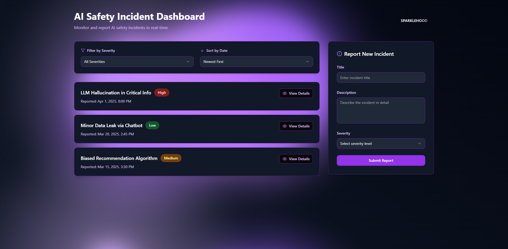

# AI Safety Incident Dashboard

A modern dashboard for monitoring, reporting, and tracking AI safety incidents in real-time.



## Project Overview

The AI Safety Incident Dashboard provides a centralized platform for organizations to track and manage AI safety incidents. This application allows users to report new incidents, filter existing incidents by severity, and sort them chronologically to prioritize response efforts.

## Features

- **Incident Reporting:** Submit new AI safety incidents with title, description, and severity level
- **Filtering & Sorting:** Filter incidents by severity (Low, Medium, High) and sort by date
- **Responsive Design:** Optimized for both desktop and mobile devices
- **Real-time Updates:** Instantly see new incidents as they're reported
- **Modern UI:** Sleek black and purple design with intuitive user interface

## Getting Started

### Prerequisites

- Node.js 16.x or higher
- npm 8.x or higher

### Installation

There are several ways to set up and run this project:

#### Option 1: Clone & Run Locally

```sh
# Step 1: Clone the repository
git clone <YOUR_GIT_URL>

# Step 2: Navigate to the project directory
cd ai-safety-incident-dashboard

# Step 3: Install dependencies
npm install

# Step 4: Start the development server
npm run dev
```

The application will be available at `http://localhost:5173`

#### Option 2: Edit Directly in GitHub

1. Navigate to the desired file(s) in the GitHub repository
2. Click the "Edit" button (pencil icon) at the top right of the file view
3. Make your changes and commit them with a descriptive message
4. The updated code will automatically be reflected in the deployed application

#### Option 3: Use GitHub Codespaces

1. Navigate to the main page of your repository
2. Click on the "Code" button (green button) near the top right
3. Select the "Codespaces" tab
4. Click on "New codespace" to launch a new development environment
5. Edit files directly within the Codespace and commit/push your changes

## Project Structure

```
├── public/              # Static assets
├── src/
│   ├── components/      # UI components
│   │   ├── Dashboard.tsx           # Main dashboard layout
│   │   ├── FilterControls.tsx      # Severity and date filtering
│   │   ├── IncidentForm.tsx        # Form for submitting new incidents
│   │   └── IncidentList.tsx        # Display of filtered incidents
│   ├── data/            # Mock data and data utilities
│   ├── types/           # TypeScript interfaces and types
│   ├── App.tsx          # Root application component
│   └── main.tsx         # Entry point
├── index.html           # HTML entry
└── package.json         # Dependencies and scripts
```

## Technology Stack

This project leverages modern web technologies:

- **Framework:** React with TypeScript
- **Build Tool:** Vite (for fast development and optimized builds)
- **UI Components:** shadcn/ui (accessible UI components)
- **Styling:** Tailwind CSS (utility-first CSS framework)
- **Animations:** Motion (for smooth transitions and effects)
- **Date Handling:** date-fns (modern JavaScript date utility library)
- **State Management:** React's built-in useState hook

## Development

### Available Scripts

- `npm run dev` - Start development server with hot module replacement
- `npm run build` - Build for production
- `npm run preview` - Preview the production build locally
- `npm run lint` - Run ESLint to check code quality
- `npm run test` - Run tests (if configured)

### Contributing

1. Create a new branch for your feature or bugfix
2. Make your changes
3. Submit a pull request with a clear description of the changes
4. Request code reviews from team members

## Deployment

The application is deployed automatically when changes are pushed to the main branch.

## License

This project is licensed under the MIT License - see the LICENSE file for details.

## Support

For questions or assistance, please contact the project team or create an issue in the GitHub repository.